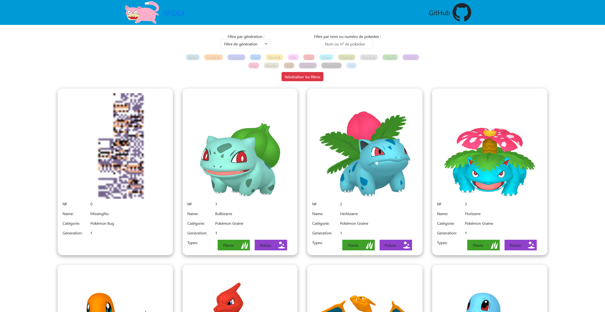
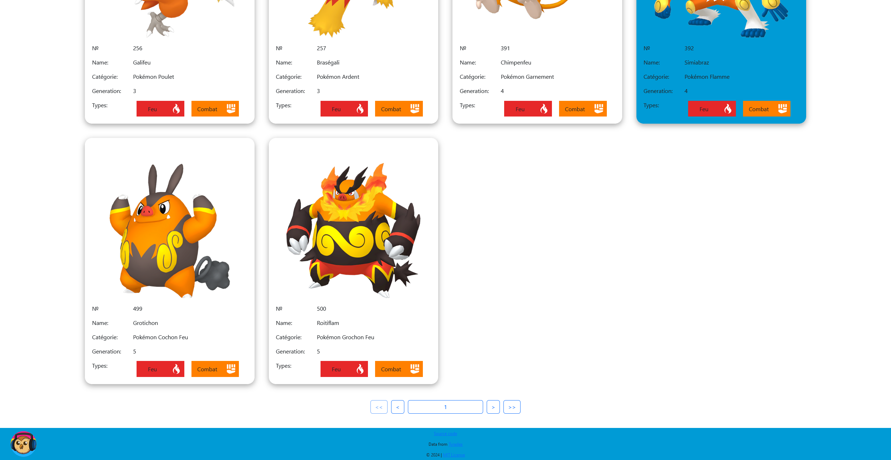
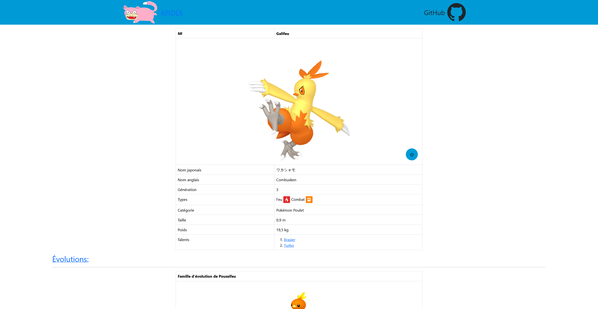
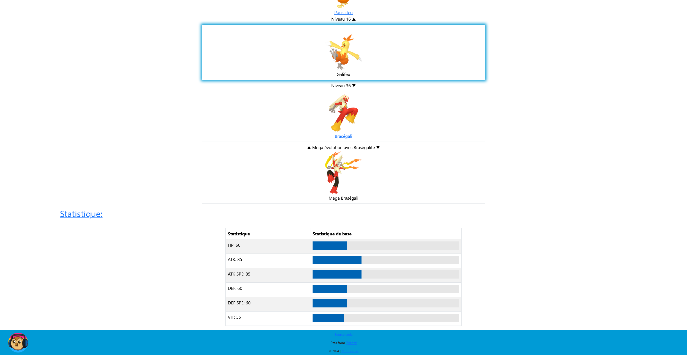

<!--suppress ALL, HtmlUnknownAnchorTarget -->

[//]: # (Find and replace apidex with the name of your repo)

<a id="readme-top"></a>

[![Contributors][contributors-shield]][contributors-url]
[![Forks][forks-shield]][forks-url]
[![Stargazers][stars-shield]][stars-url]
[![Issues][issues-shield]][issues-url]
[![MIT License][license-shield]][license-url]

<h3 align="center">Apidex</h3>


<div align="center">
  <p>
    A vue web app to browse a pokedex
    <br />
    <a href="https://github.com/Gabann/apidex/tree/main/documentation"><strong>Explore the docs »</strong></a>
    <br />
    <a href="https://github.com/gabann/apidex/issues">Report Bug</a>
    ·
    <a href="https://github.com/gabann/apidex/issues">Request Feature</a>
  </p>
</div>


<!-- TABLE OF CONTENTS -->
<details>
  <summary>Table of Contents</summary>
  <ol>
    <li>
      <a href="#about-the-project">About The Project</a>
      <ul>
        <li><a href="#built-with">Built With</a></li>
      </ul>
    </li>
    <li>
      <a href="#getting-started">Getting Started</a>
      <ul>
        <li><a href="#prerequisites">Prerequisites</a></li>
        <li><a href="#installation">Installation</a></li>
      </ul>
    </li>
    <li><a href="#usage">Usage</a></li>
    <li><a href="#preview">Preview</a></li>
    <li><a href="#roadmap">Roadmap</a></li>
    <li><a href="#contributing">Contributing</a></li>
    <li><a href="#license">License</a></li>
    <li><a href="#contacts">Contacts</a></li>
  </ol>
</details>

<!-- ABOUT THE PROJECT -->

## About the Project

This app as been built as part of my study at [M2I](https://www.m2iformation.fr/) to practice vue.js and api manipulation

The goal was to create a web app using Vue.js and pinia to fetch data from an [API](https://tyradex.tech/)  and display a list of
pokemons and their details

### Features

- **Browse Pokemon**: Explore detailed information about all Pokemon species, including their types, stats, evolution line and more.
- **Search Functionality**: Easily search for specific Pokémon by name, Pokédex number or by their types. For performance the data is
  store locally and the search is done on the local data.

### Built With

Frontend: [![Vue.js][VueBadge]][VueUrl] [![Pinia][PiniaBadge]][PiniaUrl] [![Bootstrap][BootstrapBagde]][BootstrapUrl] [![Node.js][NodeBadge]][NodeUrl]

Data from [Tyradex API](https://tyradex.tech/)

<div align="right"><a href="#readme-top">back to top</a></div>

<!-- GETTING STARTED -->

## Getting Started

### Prerequisites

This app requires [Node.js](https://nodejs.org/en) to be installed

### Installation

```bash
# Clone the project:
git clone https://github.com/Gabann/apidex.git
cd .\APIDEX

# Install the dependencies:
npm i

# Running the application:
npm run dev
```

<div align="right"><a href="#readme-top">back to top</a></div>


<!-- USAGE EXAMPLES -->

## Usage

```bash
# Building the app:
npm run build
```

The app gets optimized and minimized to the 'dist' folder and is now ready to be published

As a static web app the app can be deployed to [github pages](https://pages.github.com/)
You can automatically build and deploy the app to the 'gh-pages' branch of the repo

```bash
# Building the app and automaticaly push it to gh-pages branch:
npm run deploy
```

<div align="right"><a href="#readme-top">back to top</a></div>


<!-- PREVIEW -->

## Preview

<div style="display: flex; flex-wrap: wrap; justify-content: space-around;">
  
  
  
  
</div>

<div align="right"><a href="#readme-top">back to top</a></div>


<!-- ROADMAP -->

## Roadmap

- [ ] Rework UI, make something more modern and eye pealing like [this](https://tyradex.vercel.app/dex)
- [ ] Add a way to update the local storage if the API data changes

[//]: # (    - [ ] Nested Feature)

<div align="right"><a href="#readme-top">back to top</a></div>


<!-- CONTRIBUTING -->

## Contributing

We welcome contributions from everyone! Follow these steps to contribute:

1. **Fork** the repository.
2. **Clone** the forked repository to your local machine.
3. **Create a new branch** for your contribution.
4. **Make your changes** and **commit** them.
5. **Push** your changes to your forked repository.
6. **Open a pull request** to the main project repository.

### Contribution Guidelines

- Discuss significant changes by opening an issue first.
- Follow the existing code style and structure.
- Write clear commit messages and document your code.
- Ensure changes don't break existing functionality.
- Update documentation if necessary.

<div align="right"><a href="#readme-top">back to top</a></div>


<!-- LICENSE -->

## License

Distributed under the 'LICENSE' License. See [`LICENSE`](https://github.com/Gabann/apidex/blob/main/LICENSE) for more information.

<div align="right"><a href="#readme-top">back to top</a></div>


<!-- CONTACT -->

## Contacts

- [![Twitter][gmail-shield]][gmail-url]
- [![LinkedIn][linkedin-shield]][linkedin-url]
- [![Twitter][twitter-shield]][twitter-url]

<div align="right"><a href="#readme-top">back to top</a></div>


---------------------------------------------------------------

[repo-link]: https://github.com/Gabann/apidex

[contributors-shield]: https://img.shields.io/github/contributors/gabann/apidex.svg?style=for-the-badge

[contributors-url]: https://github.com/gabann/apidex/graphs/contributors

[forks-shield]: https://img.shields.io/github/forks/gabann/apidex.svg?style=for-the-badge

[forks-url]: https://github.com/gabann/apidex/network/members

[stars-shield]: https://img.shields.io/github/stars/gabann/apidex.svg?style=for-the-badge

[stars-url]: https://github.com/gabann/apidex/stargazers

[issues-shield]: https://img.shields.io/github/issues/gabann/apidex.svg?style=for-the-badge

[issues-url]: https://github.com/gabann/apidex/issues

[license-shield]: https://img.shields.io/github/license/gabann/apidex.svg?style=for-the-badge

[license-url]: https://github.com/gabann/apidex/blob/master/LICENSE

[linkedin-shield]: https://img.shields.io/badge/-LinkedIn-black.svg?style=for-the-badge&logo=linkedin&colorB=555

[linkedin-url]: https://linkedin.com/in/gabin-deboulogne/

[twitter-shield]: https://img.shields.io/badge/Twitter-1DA1F2?style=for-the-badge&logo=twitter&logoColor=white

[twitter-url]: https://twitter.com/gabandev

[gmail-shield]: https://img.shields.io/badge/Gmail-EA4335.svg?style=for-the-badge&logo=Gmail&logoColor=white

[gmail-url]: mailto:gabin.deboulogne@gmail.com

[VueBadge]: https://img.shields.io/badge/Vue.js-35495E?style=for-the-badge&logo=vue.js&logoColor=4FC08D

[VueUrl]: https://vuejs.org/

[PiniaBadge]: https://img.shields.io/badge/Pinia-35495E?style=for-the-badge&logo=vue.js&logoColor=4FC08D&color=FDDA0D

[PiniaUrl]: https://pinia.vuejs.org/

[BootstrapBagde]: https://img.shields.io/badge/Bootstrap-563D7C?style=for-the-badge&logo=bootstrap&logoColor=white

[BootstrapUrl]: https://getbootstrap.com/

[NodeBadge]: https://img.shields.io/badge/Node.js-339933?logo=node.js&logoColor=white&style=for-the-badge

[NodeUrl]: https://nodejs.org/
